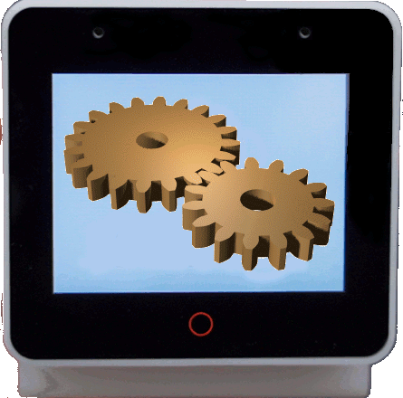
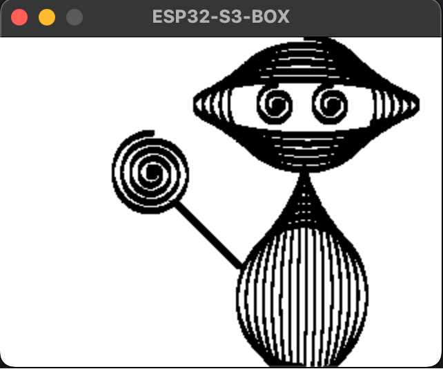

<a name="readme-top"></a>

<!-- PROJECT LOGO -->
<br />
<div align="center">
  <a href="https://github.com/sambenko/esp32s3-box-graphics-tester">
    
  </a>

<h3 align="center">ESP32S3-BOX Graphics Tester</h3>

  <p align="center">
    A simple program to test embedded graphics with esp32s3-box using embedded graphics simulator.
  </p>
  <p align="center">
    Thanks to @georgik (https://www.github.com/georgik) for creating a PR on my examples repository and suggesting this approach.
  </p>
  <p align="center">
    <b> Can't be used to test animations, only drawn examples outside of loop{} </b>
  </p>
</div>

## Usage

Let's demostrate usage on my lollipop guy example [:scroll:](https://github.com/sambenko/esp32s3-box-examples/blob/main/examples/lollipop_guy.rs "Source Code") [:art:](https://github.com/sambenko/esp32s3-box-examples/blob/main/docs/images/lollipop_guy.jpg "Picture")

Firstly, paste your packages between the comments above the main() in main.rs:

```rust
//paste your packages here (only those unrelated to chip initialisation and those that are not here already):

use examples_assets::{body_part, hand};

// end of packages
```

:bulb: <b> Relocate your drawing functionality to a separate crate for easier import as shown above</b>


Next, past your functional code between another set of comments located above loop{}:

```rust
//paste all the code after initialisation here (usually everything after you initialize the display):
    
body_part(&mut display, "'", [40.0, 50.0, 220.0, 200.0], 6400, -1, 1);
body_part(&mut display, "'", [60.0, 50.0, 220.0, 60.0], 6400, 1, -1);
body_part(&mut display, "'", [20.0, 15.0, 200.0, 60.0], 1300, -1, -1);
body_part(&mut display, "'", [20.0, 15.0, 240.0, 60.0], 1300, -1, -1);
hand(&mut display, 125, 175);
body_part(&mut display, "'", [30.0, 30.0, 110.0, 110.0], 3300, -1, -1);

// end of source code
```

Then, simply run:

```sh
   cargo run --release
```

and this should be the output you get after the program compiles:





